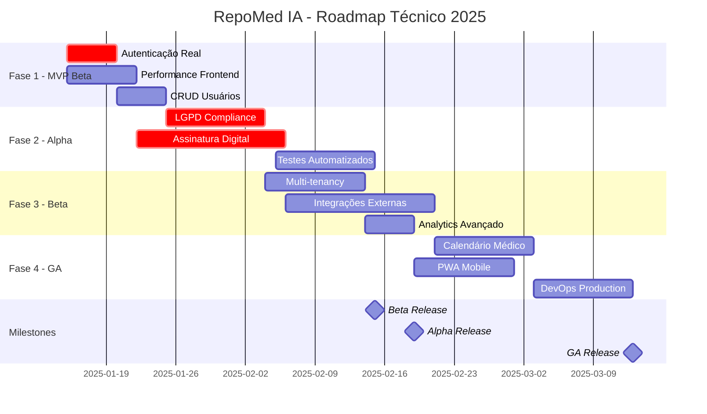

# 🗓️ Roadmap Técnico Detalhado - RepoMed IA

## 📊 Visão Geral do Cronograma

```
🎯 OBJETIVO: Transformar MVP atual em produto production-ready
📅 PRAZO TOTAL: 16 semanas (4 meses)
👥 EQUIPE: 4 pessoas (Tech Lead, Frontend, Backend, QA)
💰 ORÇAMENTO: R$ 140.000 + R$ 15.000 infraestrutura
```

---

## 🚀 FASE 1: MVP BETA (Semanas 1-2) - "Sistema Funcional"

### 🎯 Objetivo da Fase
Tornar o sistema funcional para testing interno e beta fechado

### 📋 Epic 1.1: Autenticação Real (Semana 1)
```yaml
Responsável: Backend Developer
Duração: 5 dias
Esforço: 40 horas

Tasks:
  □ Implementar página de login funcional
    - Arquivo: repomed-web/src/pages/LoginPage.jsx
    - Form com email/senha + validação
    - Esforço: 8h

  □ Implementar registro de usuários
    - Arquivo: repomed-web/src/pages/RegisterPage.jsx
    - Form completo com validações
    - Esforço: 8h

  □ Backend auth completo
    - Arquivos: repomed-api/src/routes/auth.ts
    - Hash senha + JWT real + refresh tokens
    - Esforço: 12h

  □ Middleware de proteção de rotas
    - Frontend: React Router guards
    - Backend: JWT validation
    - Esforço: 8h

  □ Persistência de sessão
    - LocalStorage + refresh automático
    - Logout em todas abas
    - Esforço: 4h

Entregáveis:
  ✅ Login funcional
  ✅ Registro funcional
  ✅ Sessão persistente
  ✅ Proteção de rotas

Dependencies: Nenhuma
Risk: Baixo (tecnologia conhecida)
```

### 📋 Epic 1.2: Otimização Performance (Semana 1-2)
```yaml
Responsável: Tech Lead + Frontend
Duração: 7 dias
Esforço: 35 horas

Tasks:
  □ Implementar code splitting
    - React.lazy() para páginas principais
    - Reduzir bundle principal < 500KB
    - Esforço: 8h

  □ Lazy loading de componentes
    - Componentes pesados (DataTable, etc)
    - Import dinâmico
    - Esforço: 6h

  □ Otimizar imports
    - Tree shaking
    - Bundle analyzer
    - Remover código não usado
    - Esforço: 8h

  □ Implementar debounce em buscas
    - useDebounce hook
    - Reduzir calls API
    - Esforço: 4h

  □ Otimizar re-renders
    - React.memo em componentes
    - useMemo para cálculos
    - Esforço: 6h

  □ Setup CDN básico
    - Assets estáticos
    - Imagens otimizadas
    - Esforço: 3h

Entregáveis:
  ✅ Bundle < 1MB total
  ✅ First Load < 2s
  ✅ Performance score > 80

Dependencies: Epic 1.1 (auth pages)
Risk: Médio (pode quebrar funcionalidade)
```

### 📋 Epic 1.3: CRUD Usuários Básico (Semana 2)
```yaml
Responsável: Backend + Frontend
Duração: 5 dias
Esforço: 30 horas

Tasks:
  □ Schema usuários completo
    - Tabela users com roles
    - Migrations
    - Esforço: 4h

  □ API CRUD usuários
    - GET /users, POST /users, etc
    - Validações Zod
    - Esforço: 8h

  □ Interface gestão usuários
    - Lista usuários
    - Criar/editar usuários
    - Esforço: 12h

  □ Sistema de roles básico
    - Admin, Médico, Secretário
    - Middleware autorização
    - Esforço: 6h

Entregáveis:
  ✅ CRUD usuários funcional
  ✅ Roles básicos implementados
  ✅ Interface administração

Dependencies: Epic 1.1 (auth base)
Risk: Baixo
```

### 🎯 Entregáveis Fase 1
- [x] Sistema de autenticação completo
- [x] Performance otimizada (bundle < 1MB)
- [x] Gestão de usuários básica
- [x] Beta testing funcional

---

## 🛡️ FASE 2: PRODUÇÃO ALPHA (Semanas 3-6) - "Seguro e Compliant"

### 🎯 Objetivo da Fase
Implementar segurança e compliance necessários para produção

### 📋 Epic 2.1: Compliance LGPD (Semanas 3-4)
```yaml
Responsável: Tech Lead + Backend
Duração: 10 dias
Esforço: 60 horas

Tasks:
  □ Criptografia dados em repouso
    - Campos sensíveis criptografados
    - Chaves de criptografia rotacionáveis
    - Esforço: 12h

  □ Logs de auditoria completos
    - Rastreamento de todas ações
    - Who, What, When, Where
    - Esforço: 8h

  □ Sistema de consentimento
    - Termos de uso + aceite
    - Opt-in/opt-out funcionalidades
    - Esforço: 8h

  □ Direito ao esquecimento
    - API para deletar dados
    - Anonização vs Deleção
    - Esforço: 10h

  □ Portabilidade de dados
    - Exportar dados usuário
    - Formato JSON estruturado
    - Esforço: 6h

  □ Políticas de retenção
    - Auto-delete dados antigos
    - Configurável por tipo
    - Esforço: 8h

  □ Privacy by design
    - Minimização de dados
    - Configurações privacidade
    - Esforço: 8h

Entregáveis:
  ✅ Compliance LGPD 90%
  ✅ Auditoria completa
  ✅ Data protection

Dependencies: Epic 1.3 (usuários)
Risk: Alto (complexidade legal)
```

### 📋 Epic 2.2: Assinatura Digital ICP-Brasil (Semanas 4-6)
```yaml
Responsável: Tech Lead + Especialista
Duração: 15 dias
Esforço: 80 horas

Tasks:
  □ Pesquisa e escolha provedor
    - Evaliar Certisign, Serasa, etc
    - Comparar APIs e custos
    - Esforço: 8h

  □ Integração API certificados A1
    - SDK do provedor escolhido
    - Testes com certificados
    - Esforço: 16h

  □ Implementar fluxo assinatura
    - Upload certificado
    - PIN/password
    - Esforço: 12h

  □ Validação assinatura
    - Verificar cadeia certificação
    - Status revogação (OCSP)
    - Esforço: 12h

  □ Interface assinatura
    - Modal assinatura
    - Feedback visual
    - Esforço: 8h

  □ Armazenamento seguro
    - HSM ou cloud HSM
    - Backup certificados
    - Esforço: 12h

  □ Compliance jurídico
    - Validação advogado
    - Documentação legal
    - Esforço: 8h

  □ Testes extensivos
    - Diferentes tipos certificado
    - Cenários de erro
    - Esforço: 4h

Entregáveis:
  ✅ Assinatura ICP-Brasil funcional
  ✅ Validade jurídica garantida
  ✅ Interface user-friendly

Dependencies: Epic 2.1 (auditoria)
Risk: Alto (integração terceiros, custo)
```

### 📋 Epic 2.3: Testes Automatizados (Semanas 5-6)
```yaml
Responsável: QA + Tech Lead
Duração: 10 dias
Esforço: 50 horas

Tasks:
  □ Testes unitários críticos
    - Componentes React principais
    - Services backend críticos
    - Coverage > 60%
    - Esforço: 20h

  □ Testes integração API
    - Todos endpoints críticos
    - Cenários happy path + edge cases
    - Esforço: 15h

  □ Testes E2E completos
    - Fluxos críticos usuário
    - Diferentes navegadores
    - Esforço: 10h

  □ Testes de segurança
    - Injection attacks
    - XSS, CSRF
    - Esforço: 5h

Entregáveis:
  ✅ 70% test coverage
  ✅ E2E automation
  ✅ Security tests

Dependencies: Epic 2.1, 2.2
Risk: Médio
```

### 🎯 Entregáveis Fase 2
- [x] LGPD compliance implementado
- [x] Assinatura digital ICP-Brasil
- [x] 70% test coverage
- [x] Sistema pronto para produção básica

---

## 🚀 FASE 3: PRODUÇÃO BETA (Semanas 7-10) - "Diferenciação"

### 🎯 Objetivo da Fase
Implementar features que diferenciam no mercado

### 📋 Epic 3.1: Multi-tenancy (Semanas 7-8)
```yaml
Responsável: Backend + Frontend
Duração: 10 dias
Esforço: 60 horas

Tasks:
  □ Schema multi-tenant
    - Tabela organizations
    - FK em todas tabelas
    - Row-level security
    - Esforço: 12h

  □ Isolamento dados
    - Queries com tenant filter
    - Middleware tenant context
    - Esforço: 16h

  □ Interface organizações
    - Criar/editar organização
    - Convitar usuários
    - Esforço: 12h

  □ Billing por organização
    - Quotas e limites
    - Usage tracking
    - Esforço: 12h

  □ Branding customizado
    - Logo e cores
    - Custom domains
    - Esforço: 8h

Entregáveis:
  ✅ Multi-tenancy completo
  ✅ Isolamento garantido
  ✅ Modelo SaaS funcional

Dependencies: Fase 2 completa
Risk: Alto (migração dados)
```

### 📋 Epic 3.2: Integrações Externas (Semanas 8-10)
```yaml
Responsável: Backend Developer
Duração: 15 dias
Esforço: 70 horas

Tasks:
  □ WhatsApp Business API
    - Integração oficial
    - Templates mensagem
    - Envio automático
    - Esforço: 20h

  □ ANVISA Bulário
    - Scraping ou API oficial
    - Cache medicamentos
    - Busca e validação
    - Esforço: 16h

  □ RNDS/FHIR básico
    - Conexão teste
    - Mapping dados
    - Esforço: 12h

  □ Gateway SMS
    - Backup WhatsApp
    - Lembretes consulta
    - Esforço: 8h

  □ Email marketing
    - SendGrid integration
    - Templates newsletter
    - Esforço: 8h

  □ Storage cloud
    - AWS S3 para arquivos
    - CDN para performance
    - Esforço: 6h

Entregáveis:
  ✅ WhatsApp funcional
  ✅ Bulário integrado
  ✅ Comunicação completa

Dependencies: Epic 3.1
Risk: Médio (APIs terceiros)
```

### 📋 Epic 3.3: Analytics Avançado (Semana 10)
```yaml
Responsável: Frontend + Backend
Duração: 5 dias
Esforço: 30 horas

Tasks:
  □ Dashboard executivo
    - KPIs principais
    - Gráficos avançados
    - Esforço: 12h

  □ Relatórios customizáveis
    - Query builder visual
    - Export PDF/Excel
    - Esforço: 10h

  □ Analytics uso
    - Tracking eventos
    - Funis conversão
    - Esforço: 8h

Entregáveis:
  ✅ Dashboard avançado
  ✅ Relatórios customizáveis

Dependencies: Dados suficientes
Risk: Baixo
```

### 🎯 Entregáveis Fase 3
- [x] Multi-tenancy implementado
- [x] Integrações externas funcionais
- [x] Analytics diferenciado
- [x] Produto competitivo no mercado

---

## 🏁 FASE 4: PRODUÇÃO GA (Semanas 11-16) - "Produto Completo"

### 🎯 Objetivo da Fase
Features avançadas e polish para lançamento público

### 📋 Epic 4.1: Calendário Médico (Semanas 11-12)
```yaml
Responsável: Frontend + Backend
Duração: 10 dias
Esforço: 60 horas

Tasks:
  □ Schema agendamento
    - Appointments table
    - Recorrência
    - Esforço: 8h

  □ Interface calendário
    - FullCalendar.js
    - Drag & drop
    - Esforço: 20h

  □ Agendamento online
    - Link público
    - Horários disponíveis
    - Esforço: 16h

  □ Lembretes automáticos
    - WhatsApp + SMS
    - 24h antes
    - Esforço: 12h

  □ Lista espera
    - Cancelamento automático
    - Notificação vaga
    - Esforço: 4h

Entregáveis:
  ✅ Calendário completo
  ✅ Agendamento online
  ✅ Lembretes automáticos

Dependencies: Epic 3.2 (WhatsApp)
Risk: Médio
```

### 📋 Epic 4.2: PWA e Mobile (Semanas 13-14)
```yaml
Responsável: Frontend Developer
Duração: 10 dias
Esforço: 50 horas

Tasks:
  □ Service Worker completo
    - Offline pages
    - Background sync
    - Esforço: 12h

  □ Push notifications
    - Firebase integration
    - Subscription management
    - Esforço: 10h

  □ App install prompt
    - Custom install UI
    - iOS/Android support
    - Esforço: 8h

  □ Mobile optimizations
    - Touch gestures
    - Camera integration
    - Esforço: 12h

  □ Offline functionality
    - Cache critical data
    - Sync when online
    - Esforço: 8h

Entregáveis:
  ✅ PWA completo
  ✅ Offline functionality
  ✅ Mobile-first

Dependencies: Nenhuma
Risk: Médio
```

### 📋 Epic 4.3: DevOps Production (Semanas 15-16)
```yaml
Responsável: DevOps + Tech Lead
Duração: 10 dias
Esforço: 50 horas

Tasks:
  □ CI/CD Pipeline
    - GitHub Actions
    - Automated tests
    - Deployment automático
    - Esforço: 12h

  □ Kubernetes setup
    - Cluster production
    - Auto-scaling
    - Esforço: 12h

  □ Monitoring production
    - Prometheus + Grafana
    - Alerting rules
    - Esforço: 8h

  □ Backup automatizado
    - Database backups
    - Recovery procedures
    - Esforço: 8h

  □ Security hardening
    - WAF setup
    - SSL certificates
    - Esforço: 6h

  □ Documentation
    - Runbooks
    - Troubleshooting
    - Esforço: 4h

Entregáveis:
  ✅ Production infrastructure
  ✅ Automated deployment
  ✅ Monitoring completo

Dependencies: Todas fases anteriores
Risk: Alto (infraestrutura)
```

### 🎯 Entregáveis Fase 4
- [x] Calendário médico funcional
- [x] PWA mobile-ready
- [x] Infraestrutura production
- [x] Produto pronto para lançamento

---

## 📅 Timeline Visual



---

## 👥 Alocação de Recursos

### **Semanas 1-2 (MVP Beta)**
```
Tech Lead (40h/semana):
- Autenticação backend (16h)
- Performance optimization (24h)

Frontend Developer (40h/semana):
- Login/Register pages (20h)
- Performance frontend (20h)

Backend Developer (40h/semana):
- CRUD usuários (20h)
- APIs auth (20h)

QA Engineer (20h/semana):
- Testes auth (10h)
- Testes performance (10h)

TOTAL: 140 horas/semana
```

### **Semanas 3-6 (Alpha)**
```
Tech Lead (40h/semana):
- Arquitetura LGPD (30h/semana)
- Code reviews (10h/semana)

Backend Developer (40h/semana):
- Assinatura digital (25h/semana)
- LGPD implementation (15h/semana)

Frontend Developer (40h/semana):
- Interfaces compliance (20h/semana)
- Testes frontend (20h/semana)

QA Engineer (30h/semana):
- Testes automatizados (30h/semana)

TOTAL: 150 horas/semana
```

### **Semanas 7-10 (Beta)**
```
Foco em diferenciação e integrações
TOTAL: 160 horas/semana
```

### **Semanas 11-16 (GA)**
```
Polish, mobile e infraestrutura
TOTAL: 140 horas/semana
```

---

## 💰 Orçamento Detalhado

### **Recursos Humanos (16 semanas)**
```
Tech Lead (R$ 120/h × 40h × 16w):      R$ 76.800
Frontend Dev (R$ 80/h × 40h × 16w):    R$ 51.200  
Backend Dev (R$ 80/h × 40h × 16w):     R$ 51.200
QA Engineer (R$ 60/h × 25h × 16w):     R$ 24.000

SUBTOTAL PESSOAS:                      R$ 203.200
```

### **Infraestrutura e Serviços**
```
AWS/GCP (16 meses):                    R$ 32.000
OpenAI API:                           R$ 8.000
Certificados ICP-Brasil:               R$ 5.000
WhatsApp Business:                     R$ 3.000
Monitoring tools:                      R$ 2.000
Outros serviços:                       R$ 5.000

SUBTOTAL INFRAESTRUTURA:               R$ 55.000
```

### **ORÇAMENTO TOTAL: R$ 258.200**

---

## ⚠️ Riscos e Mitigações

### 🔴 **Riscos Altos**

1. **Integração ICP-Brasil (Semana 4-6)**
   - **Risco**: APIs complexas, certificação cara
   - **Impacto**: Delay 2-4 semanas
   - **Mitigação**: Pesquisa antecipada, POC rápido
   - **Plano B**: Mock melhorado para beta

2. **Multi-tenancy Migration (Semana 7-8)**
   - **Risco**: Quebrar dados existentes
   - **Impacto**: Rollback necessário
   - **Mitigação**: Migrations extensivamente testadas
   - **Plano B**: Feature toggle

3. **Performance em Produção (Semana 15-16)**
   - **Risco**: Gargalos não identificados
   - **Impacto**: UX ruim no lançamento
   - **Mitigação**: Load testing antecipado
   - **Plano B**: Auto-scaling agressivo

### 🟡 **Riscos Médios**

1. **APIs Terceiros (Semana 8-10)**
   - **Risco**: Rate limits, instabilidade
   - **Mitigação**: Circuit breaker, fallbacks

2. **Bundle Size (Semana 1-2)**
   - **Risco**: Optimization quebrar features
   - **Mitigação**: Testing extensivo

### 🟢 **Riscos Baixos**

1. **Testes Automatizados**: Tecnologia conhecida
2. **Frontend Polish**: Iterativo, não crítico

---

## 🎯 Critérios de Sucesso

### **MVP Beta (Semana 2)**
- [ ] Login/logout funcional
- [ ] Bundle < 1MB
- [ ] Lighthouse > 80
- [ ] Beta users conseguem usar

### **Alpha (Semana 6)**
- [ ] LGPD compliance > 90%
- [ ] Assinatura válida juridicamente  
- [ ] Test coverage > 70%
- [ ] Zero critical security issues

### **Beta (Semana 10)**
- [ ] Multi-tenant funcional
- [ ] Integrações externas estáveis
- [ ] 1000+ beta users

### **GA (Semana 16)**
- [ ] Uptime > 99.5%
- [ ] Response time < 500ms P95
- [ ] NPS > 50
- [ ] Revenue positive

---

## 📝 Conclusão do Roadmap

### **Viabilidade: ALTA** ✅

O roadmap é **ambicioso mas realizável** com a equipe proposta. Pontos críticos:

1. **Semanas 1-6 são críticas** - bases do produto
2. **Integração ICP-Brasil é o maior risco** - planejar bem
3. **Multi-tenancy é complexa** - mas necessária
4. **Semanas 11-16 são polish** - podem ser ajustadas

### **Recomendações Finais**

1. **Começar HOJE** com Epic 1.1 (autenticação)
2. **Contratar QA** desde semana 1
3. **POC assinatura digital** em paralelo semana 1
4. **Buffer 20%** no cronograma para imprevistos
5. **Beta fechado semana 6** para feedback real

Com disciplina de execução e foco nas prioridades certas, o **RepoMed IA estará pronto para lançamento público em Maio 2025**.

---

*Roadmap criado: Janeiro 2025*  
*Próxima revisão: Fevereiro 2025*  
*Owner: Tech Lead RepoMed IA*